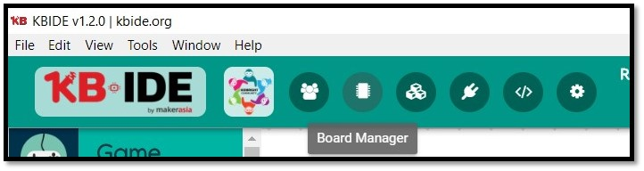
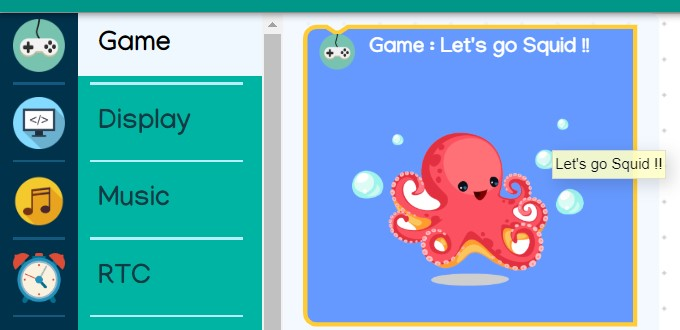
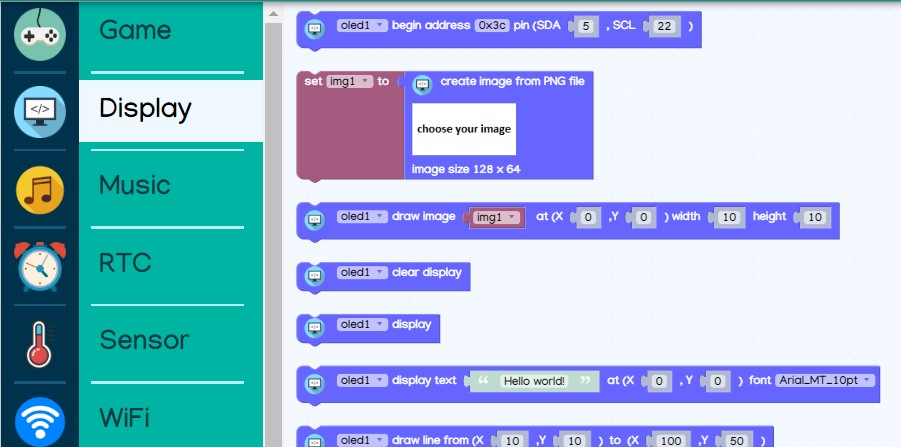
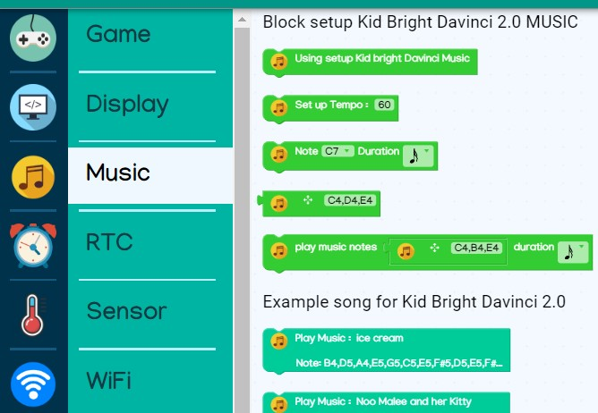
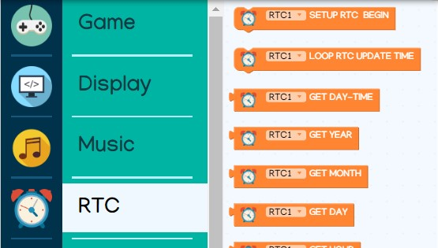
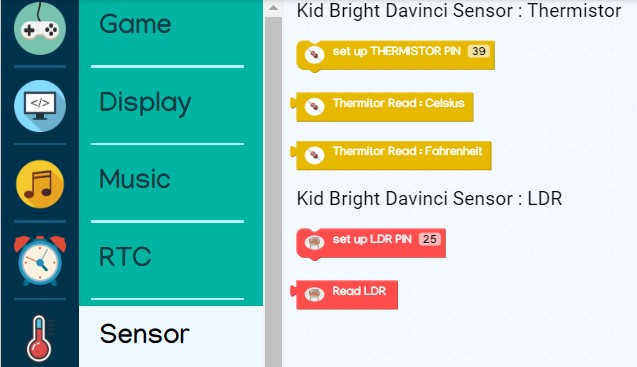
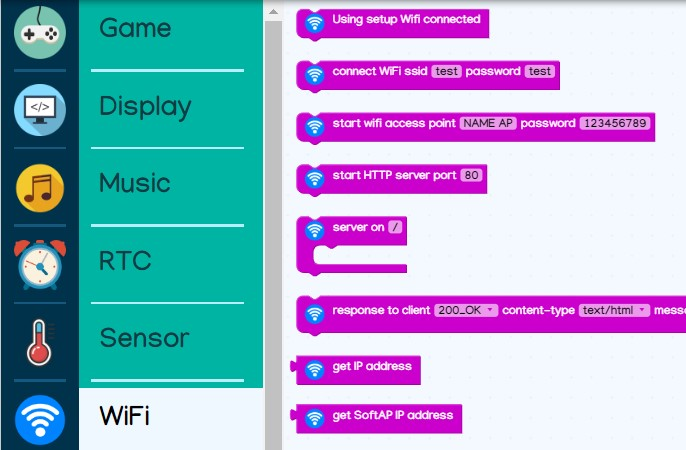
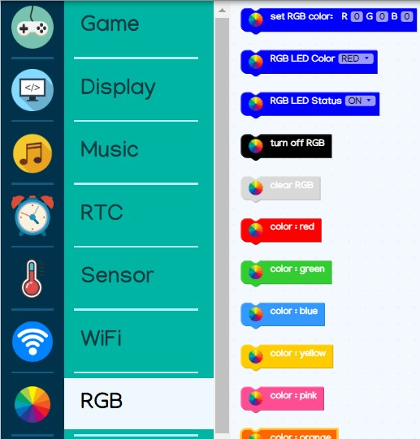
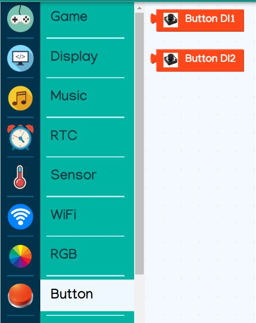
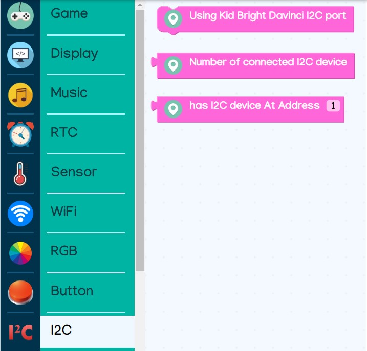

# Kid Bright Davinci 2.0
### การติดตั้ง
1. ติดตั้ง KBIDE โดยสามารถดาวน์โหลดได้จาก https://kbide.org/
2. เปิดโปรแกรม KBIDE จากนั้น เลือกเมนู Board Manager

3. ค้นหาบอร์ด โดยพิมพ์คำว่า 'Kid Bright Davinci 2.0' จากนั้นให้ทำการดาวน์โหลดบอร์ด
 

> หมายเหตุ : หากไม่สามารถดาวน์โหลดผ่าน Board Manager ใน KBIDE ได้ ให้ทำการดาวน์โหลดจาก https://github.com/chp-lab/Kidbright-Davinci-2 แทน จากนั้นให้ Extract zip ไฟล์และนำโฟลเดอร์ของบอร์ด(เปลี่ยนชื่อ folder ที่ได้เป็น Kidbright-Davinci-2 ก่อน) ไปวางที่ Board folder ของ KBIDE (สามารถเปิด Board folder ของ KBIDE โดยการเลือกเมนู File > Open Board folder)

### การเรียกใช้งาน
หลังจากติดตั้ง Kid Bright Davinci 2.0 เรียบร้อยแล้ว ให้ทำตามขั้นตอนต่อไปนี้
1. เลือกเมนู Board Manager
2. เลือก Kid Bright Davinci 2.0 แล้วกด Change Board

### แนะนำเมนู block ของ Kid Bright Davinci 2.0
บอร์ด Kid Bright Davinci 2.0 มีเมนูต่างๆที่ผู้ใช้งานสามารถเลือกใช้งานได้ ดังนี้
- เมนู Game : เป็นเมนูที่มี block สำหรับเกมอยู่ โดยผู้ใช้งานสามารถนำ block ดังกล่าวมาต่อลงภายใน block Loop เพื่อจะใช้งานเกม
 
- เมนู Display : เป็นเมนูที่มี block ที่เกี่ยวกับการใช้งานจอ OLED ของ Kid Bright Davinci 2.0
 
- เมนู Music : เป็นเมนูที่มี block สำหรับควบคุม Buzzer ของ Kid Bright Davinci 2.0 พร้อมทั้งมีตัวอย่างเพลงให้ลองทดสอบ
 
- เมนู RTC : เป็นเมนูที่มี block สำหรับใช้งาน RTC Module ของ Kid Bright Davinci 2.0
 
- เมนู Sensor : เป็นเมนูที่มี block สำหรับใช้งาน Thermistor (วัดอุณหภูมิ) และ LDR (วัดความสว่างความเข้มแสง) ที่อยู่บน Kid Bright Davinci 2.0
 
- เมนู WiFi : เป็นเมนูที่มี block สำหรับจัดการการเชื่อมต่อ WiFi และ Web Server ให้กับ Kid Bright Davinci 2.0
 
- เมนู RGB : เป็นเมนูที่มี block สำหรับควบคุม RGB LED บน Kid Bright Davinci 2.0
 
- เมนู Button : เป็นเมนูที่มี block สำหรับจัดการ event ของปุ่มกด (DI1 และ DI2) ของ Kid Bright Davinci 2.0
 
- เมนู I2C : เป็นเมนูที่มี block สำหรับตรวจสอบการอุปกรณ์เชื่อมต่อผ่าน I2C port
 