# Kid Bright Davinci 2.0
### การติดตั้ง
1. ติดตั้ง KBIDE โดยสามารถดาวน์โหลดได้จาก https://kbide.org/
2. เปิดโปรแกรม KBIDE จากนั้น เลือกเมนู Board Manager

3. ค้นหาบอร์ด โดยพิมพ์คำว่า 'Kid Bright Davinci 2.0' จากนั้นให้ทำการดาวน์โหลดบอร์ด
 

> หมายเหตุ : หากไม่สามารถดาวน์โหลดผ่าน Board Manager ใน KBIDE ได้ ให้ทำการดาวน์โหลดจาก https://github.com/chp-lab/Kidbright-Davinci-2 แทน จากนั้นให้ Extract zip ไฟล์และนำโฟลเดอร์ของบอร์ด(เปลี่ยนชื่อ folder ที่ได้เป็น Kidbright-Davinci-2 ก่อน) ไปวางที่ Board folder ของ KBIDE (สามารถเปิด Board folder ของ KBIDE โดยการเลือกเมนู File > Open Board folder)

### การเรียกใช้งาน
หลังจากติดตั้ง Kid Bright Davinci 2.0 เรียบร้อยแล้ว ให้ทำตามขั้นตอนต่อไปนี้
1. เลือกเมนู Board Manager
2. เลือก Kid Bright Davinci 2.0 แล้วกด Change Board

### แนะนำเมนู block ของ Kid Bright Davinci 2.0
บอร์ด Kid Bright Davinci 2.0 มีเมนูต่างๆที่ผู้ใช้งานสามารถเลือกใช้งานได้ ดังนี้
--------------------------------
#### เมนู Blink :
 
  เป็นเมนูที่ใช้งานไฟ LED (RGB) ที่สามารถทำให้ติดและดับได้ โดยประกอบไปด้วย 2 block ได้แก่
  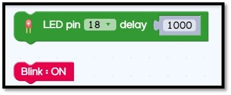 

--------------------------------
#### เมนู Game :
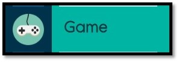 
  เป็นเมนูที่มี block สำหรับเกม โดยผู้ใช้งานสามารถนำ block ดังกล่าวมาต่อลงภายใน block Loop เพื่อจะใช้งานเกม
   

--------------------------------
#### เมนู Display :
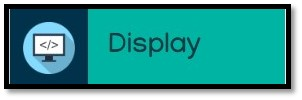 
  เป็นเมนูที่มี block ที่เกี่ยวกับการใช้งานจอ OLED ของ Kid Bright Davinci 2.0
   

--------------------------------
#### เมนู Music :
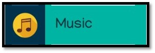 
  เป็นเมนูที่มี block สำหรับควบคุม Buzzer ของ Kid Bright Davinci 2.0 พร้อมทั้งมีตัวอย่างเพลงให้ลองทดสอบ
  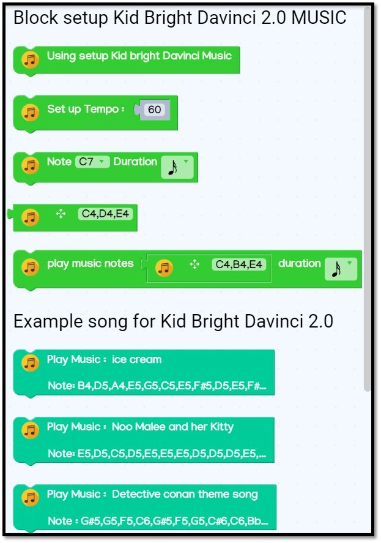 

--------------------------------
#### เมนู RTC :
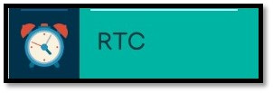 
  เป็นเมนูที่มี block สำหรับใช้งาน RTC Module ของ Kid Bright Davinci 2.0
  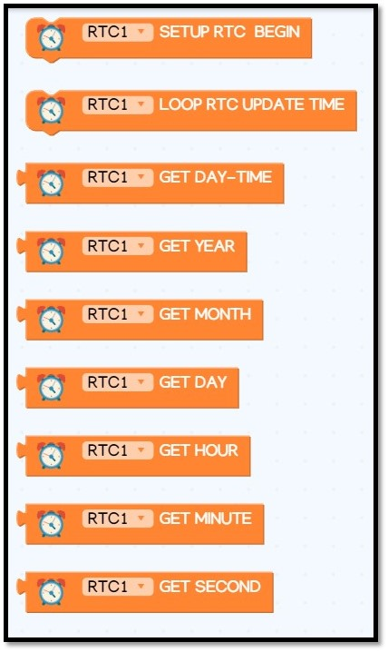 

--------------------------------
#### เมนู Servo:
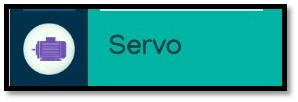 
  เป็นเมนูที่มี block สำหรับใช้งาน Servo ที่เป็นอุปกรณ์ plugin นอก ที่สามารถนำมาใช้งานกับ board Kid Bright Davinci 2.0 ได้ โดยประกอบด้วย block ดังนี้
  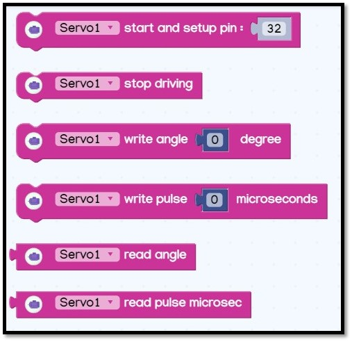 

--------------------------------
#### เมนู Sensor :
 
  เป็นเมนูที่มี block สำหรับใช้งาน Thermistor (วัดอุณหภูมิ) และ LDR (วัดความสว่างความเข้มแสง) ที่อยู่บน Kid Bright Davinci 2.0
   

--------------------------------
#### เมนู Ex Sensor :
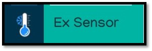 
  เป็นเมนูที่มี block สำหรับใช้งาน Thermistor (วัดอุณหภูมิ) และ LDR (วัดความสว่างความเข้มแสง) ที่อยู่บน Kid Bright Davinci 2.0
  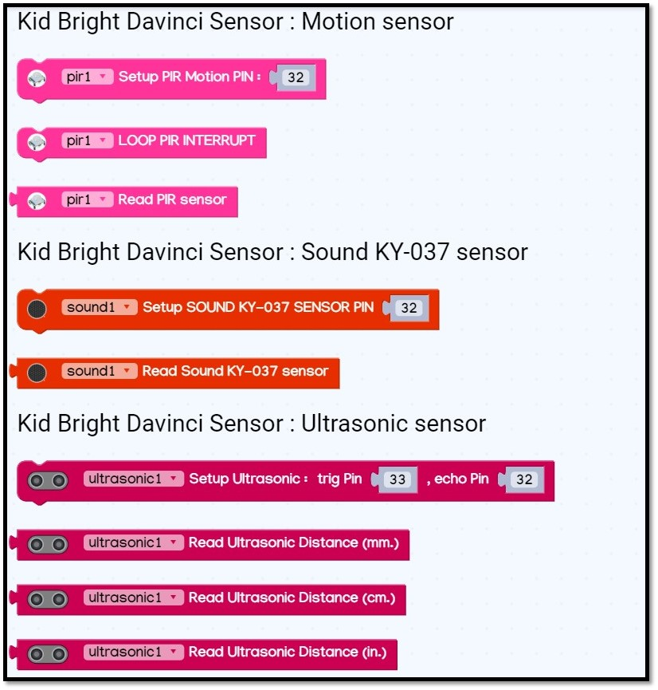 
   

--------------------------------
#### เมนู WiFi :
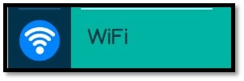 
  เป็นเมนูที่มี block สำหรับจัดการการเชื่อมต่อ WiFi และ Web Server ให้กับ Kid Bright Davinci 2.0
  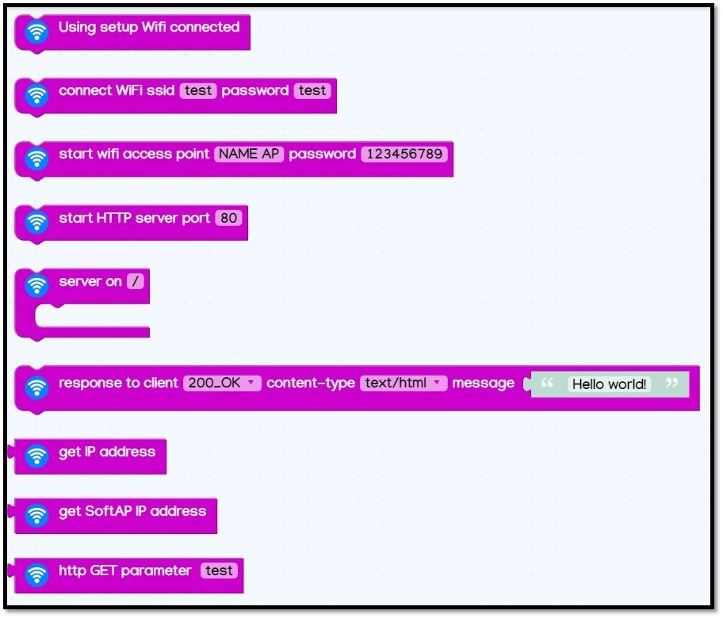 

--------------------------------
#### เมนู RGB :
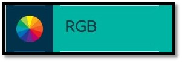 
  เป็นเมนูที่มี block สำหรับควบคุม RGB LED บน Kid Bright Davinci 2.0
   

--------------------------------
#### เมนู Button :
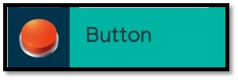 
  เป็นเมนูที่มี block สำหรับจัดการ event ของปุ่มกด (DI1 และ DI2) ของ Kid Bright Davinci 2.0
  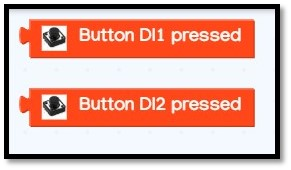 

--------------------------------
#### เมนู Iot-NEXPIE :
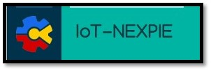 
  เป็นเมนูที่มี block สำหรับการเชื่อมต่อ MQTT เช่น การเชื่อมต่อ MQTT ของ nexpie หรือ netpie เพื่อการใช้งาน block Iot ให้สามารถใช้งานได้บน Kid Bright Davinci 2.0
   

--------------------------------
#### เมนู I2C :
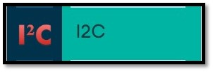 
  เป็นเมนูที่มี block สำหรับตรวจสอบการอุปกรณ์เชื่อมต่อผ่าน I2C port
  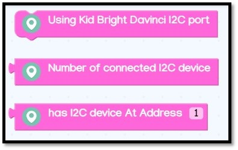 

--------------------------------
### ตัวอย่างการใช้งาน block ต่างๆ
  โดยการเริ่มการใช้งานนั้น ซึ่งมีตัวอย่างของการต่อ block สามารถเข้าได้ดังนี้
#### 1.คลิกเลือก Examples & tutorial :
 

#### 2.จากนั้นจะพบกับ memu Board  Examples:
   โดยเมนูที่พบนั้นจะเป็น list folder ของตัวอย่างการต่อ blockly ทั้งหมด ที่สามารถใช้งานได้บน Kid Bright Davinci 2.0
 

#### 3.จากนั้นเมื่อคลิกตรง folder ที่ต้องการตัวอย่างนั้น
  โดยจะพบกับ ปุ่มเลือก open block ซึ่งเป็นการเปิด ตัวอย่างการใช้งาน และปุ่ม open code เป็นการเปิด ส่วนของ code c++ เพื่อศึกษาการทำงานแบบรูปแบบ coding หรือสามารถนำไปใช้งานบน arduino IDE ได้เช่นกัน
  
